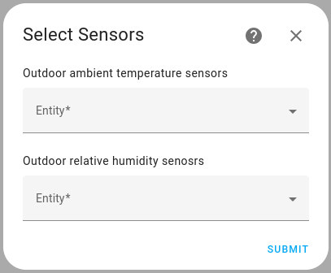
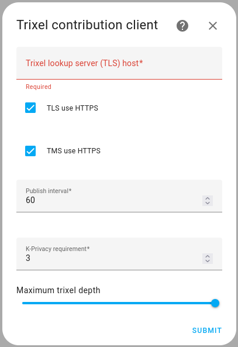

# Trixel Network integrations

This repository contains [Home Assistant](https://home-assistant.io/) integrations related to the trixel-based, privacy-aware sensor network.
As of the time of writing, only a contributing client is supported.

The `trixel_contribution_client` integrations wraps the [Trixel Service Client](https://github.com/TillFleisch/TrixelServiceClient) to be usable within Home Assistant.
Thus, sensors integrated into Home Assistant can be used for contribution to the sensor network.

## Usage

### Setup using `custom_components`:

1. Copy the directory `custom_components/trixel_contribution_client` to the `config/custom_components` directory of your Home Assistant instance.
2. Restart Home Assistant
3. Set-up the integration via `Add Integration` in the user interface

### Configuration options

Make sure the location of your Home is defined and correct within your Home Assistant instance.
See `Settings`->`System`->`General`->`Edit Location`.

- Select the `Trixel Contribution Client` from the integration list

- For each measurement type, select suitable sensors for contribution. Multiple sensors can be selected per type.

- `Trixel Lookup Server(TLS) host`: The address of TLS where you want your smart home to contribute.
- `TLS use HTTPS`: If selected, HTTPS will be used while communicating with the TLS, otherwise HTTP will be used.
- `TMS use HTTPS`: If selected, HTTPS will be used while communicating with the TMS, otherwise HTTP will be used.
- `Publish interval`: Determines how often updates are sent to the sensor network.
- `K-Privacy requirement`: The $K$-Location and Data privacy requirement that is enforced for contributions.
- `Maximum trixel depth`: The deepest allowed trixel depth to which this client is allowed to descend.

The `Reconfigure integration` option can be used to change most configuration options, including sensor selection, after the integration has been set up.

Once set-up, the integration will start contributing according to your settings.

## Development

The source code is based on the [Home Assistant Integration Scaffold tool](https://developers.home-assistant.io/docs/creating_component_index/).

The use of a [Home Assistant development environment](https://developers.home-assistant.io/docs/development_environment/) is recommended.
Thus, the code style guidelines of the Home Assistant core repository also apply in this repository.
[Pre-commit](https://pre-commit.com/) is used to enforce code-formatting, formatting tools are mentioned [here](.pre-commit-config.yaml).
